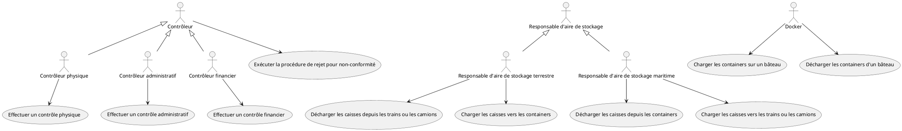
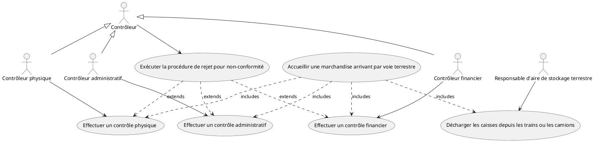
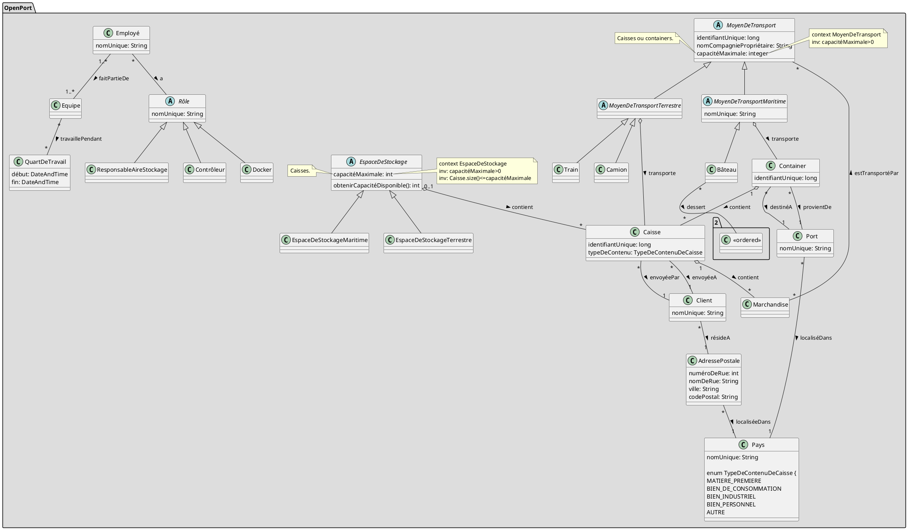
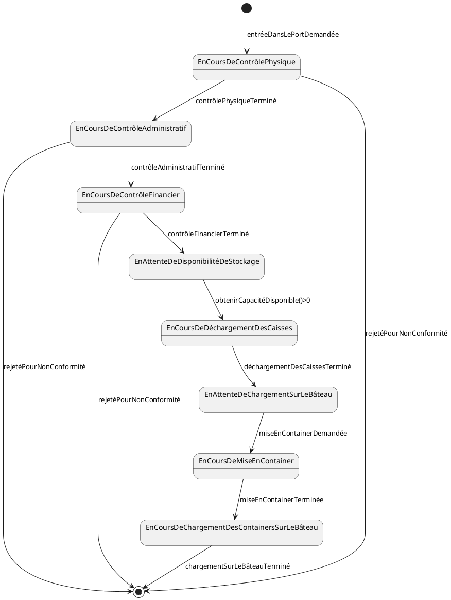
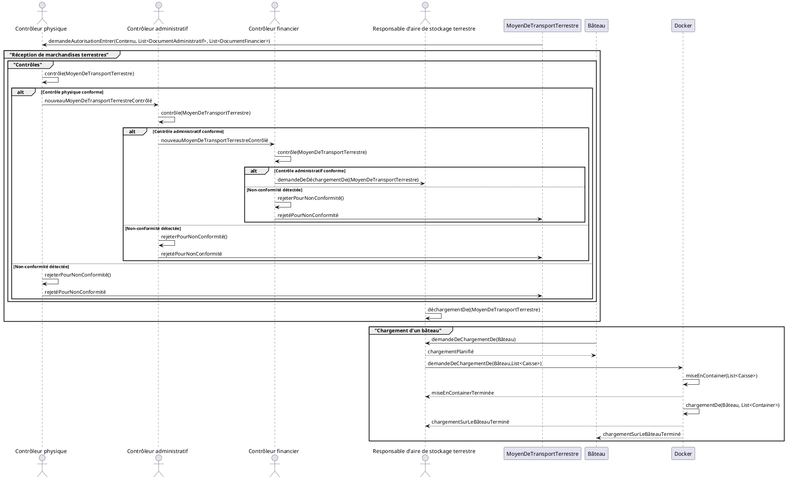

# 2024-2025 - SEG2505 - Examen final - Préparation - 1 - Correction

## Hypothèses

- Les marchandises circulent en caisse lorsqu'elles sont transportées (à l'arrivée ou au départ du port) par voie terrestre.
- Les caisses sont mises en container dans l'aire de stockage des caisses de marchandises qui arrivent par voie terrestre.
- Les containers qui arrivent par voie maritime sont déchargés et vidés dans l'aire de stockage des caisses de marchandises qui arrivent par voie maritime.

## Diagramme de cas d'utilisation

Le système doit traiter les principaux cas d'utilisation suivants :

- pour le responsable d'aire de stockage :
  - Décharger les caisses depuis les trains ou les camions
  - Charger les caisses vers les trains ou les camions
  - Décharger les caisses depuis les containers
  - Charger les caisses vers les containers

- pour les contrôleurs (physiques, administratif et financiers) :
  - Effectuer un contrôle physique
  - Effectuer un contrôle administratif
  - Effectuer un contrôle financier
  - Exécuter la procédure de rejet pour non-conformité

- pour les dockers :
  -  Charger les containers sur un bâteau
  -  Décharger les containers d'un bâteau

Le diagramme de cas d'utilisation suivant détaille le cas d'utilisation "Accueillir une marchandise arrivant par voie terrestre" (il s'agit en fait d'un sous-ensemble du diagramme précédent, avec utilisation des liens extensions et des inclusions de cas):

## Diagramme de classes

Les principaux concepts utilisés par le système sont les suivants :

Remarques :

- L'utilisation d'une classe "Marchandise" n'est pas franchement utile car le système de gestion du port ne manipule que des caisses et des containers. Ceci dit, la spécification fait explicitement référence à la notion de marchandise, donc il est naturel de l'inclure à ce niveau d'avancement du projet (ou en tout cas : en première lecture de la spécification). Plus tard, lorsque le projet aura mûri, cette classe "Marchandise" pourra disparaître pour simplifier le modèle, ceci sans perdre d'information essentielle.
- Les classes "Train" et "Camion" sont vides ; leur présence n'est maintenue que  parce la spécification y fait explicitement référence et on pense que, dans la suite du projet, on aura besoin de les spécialiser en leur associant des attributs et des comportements spécifiques.
- L'ajout de la classe "Client" n'est pas franchement requise : elle permet uniquement de distinguer des clients qui partagent la même adresse postale. Attention : cela pourrait être considéré comme de la "sur-spécification" parce qu'on suppose l'existence de quelque chose qu'on inclut dans le modèle alors que ce n'est pas absolument nécessaire pour la compréhension et le fonctionnement du système.
- Il serait possible d'ajouter des contraintes OCL pour exprimer que :
  - toutes les caisses contenues dans un container doivent avoir le même pays de destination que le container ;
  - chaque container chargé sur un bâteau doit avoir un port de destination qui est sur le trajet suivi par un bâteau ... à condition de prendre pour hypothèses que les containers ne peuvent pas être transférées d'une ligne maritime à l'autre dans un port.

## Diagrammes d'états

Le diagramme suivant décrit les états qu'une instance de marchandise arrivant par voie terrestre peut prendre, depuis son arrivée aux portes du port, jusqu’à son départ sur un bâteau.

## Diagrammes de séquences

Le diagramme suivant illustre la séquence d'actions impliquées dans l’accueil d’une marchandise arrivant par voie terrestre, depuis son arrivée aux portes du port, jusqu’à son départ sur un bâteau.

Remarques :

- Certaines des classes et des méthodes utilisées ne sont pas mentionnées dans le diagramme de classes ; elles peuvent être rajoutées après coup, au moment de l'établissement des nouveaux diagrammes et du raffinement de la spécification : c'est une démarche typique du processus itératif de modélisation.
- Les contrôleurs et le responsable d'aire de stockage s'informent en cascade de la progression du processus par des échanges synchrones plutôt que par des évènements / notifications (donc des messages asynchrones) : cela permet de se prémunir contre la perte d'un message qui pourrait interrompre le processus suivi par une marchandise au risque dde la laisser indéfiniment en attente à l'intérieur du port.
- Rappel :
  - les fragments combinés "alt" sont utilisés pour modéliser des conditions multiples ou le traitement d'une ou plusieurs exceptions (i.e interruption d'un processus par un évènement / une anomalie) ;
  - les fragments combinés "opt" sont utilisés pour modéliser une interaction (ou une suite d'interactions) qui s'exécutent si un unique condition est vérifiée.
